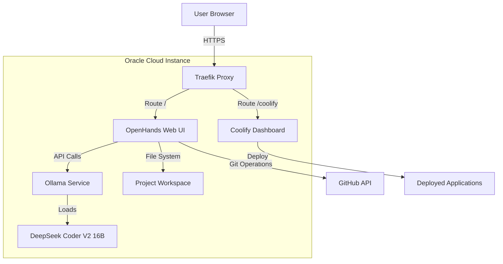

# Design Document

## Overview

This design document outlines the architecture and implementation approach for a self-hosted AI coding platform on Oracle Cloud infrastructure. The system combines Ollama (for running AI models locally), OpenHands (autonomous coding agent), and Coolify (deployment platform) to create a Vibe Coding-like experience without requiring paid API services.

The platform will be accessible via web browser at a custom domain, utilize the DeepSeek Coder V2 16B model for code generation, integrate with GitHub for version control, and support deployment through Coolify.

**Key Design Principles:**
- Zero external API costs (all AI processing local)
- Web-based access (no local installation required)
- GitHub integration for version control
- Automated deployment pipeline
- Resource-efficient operation on Oracle Cloud Free Tier
- Security-first approach with HTTPS and authentication

## Architecture

### High-Level Architecture



### Component Architecture

**Layer 1: Reverse Proxy (Traefik)**
- Handles HTTPS termination
- Routes traffic to appropriate services
- Manages SSL certificates via Let's Encrypt
- Already configured by Coolify

**Layer 2: Application Services**
- OpenHands: Web-based coding interface
- Ollama: AI model inference engine
- Coolify: Deployment and management platform

**Layer 3: Storage & Integration**
- Docker volumes for persistent data
- GitHub API for version control
- Local file system for project workspaces

### Network Architecture

All services run in Docker containers connected via the `ai-coding-network` bridge network:

```
ai-coding-network (Docker Bridge)
├── coolify-proxy (Traefik) - Ports: 80, 443, 8000
├── ollama - Port: 11434
└── openhands - Port: 3000
```

**Port Mapping:**
- 80/443: HTTP/HTTPS (Traefik)
- 8000: Coolify Dashboard
- 11434: Ollama API (internal)
- 3000: OpenHands UI (proxied through Traefik)

## Components and Interfaces

### 1. Ollama Service

**Purpose:** Run AI models locally for code generation

**Configuration:**
```yaml
Service: ollama/ollama:latest
Ports: 11434 (internal)
Volumes: 
  - ollama-data:/root/.ollama
Environment:
  - OLLAMA_HOST=0.0.0.0:11434
Resources:
  - Memory: 16GB minimum
  - CPU: 4+ cores recommended
Network: ai-coding-network
```

**API Interface:**
```
POST /api/generate
{
  "model": "deepseek-coder-v2:16b",
  "prompt": "string",
  "stream": true
}

POST /api/chat
{
  "model": "deepseek-coder-v2:16b",
  "messages": [{"role": "user", "content": "string"}],
  "stream": true
}
```

**Model Management:**
```bash
# Pull model
ollama pull deepseek-coder-v2:16b

# List models
ollama list

# Remove model
ollama rm <model-name>
```

### 2. OpenHands (Autonomous Coding Agent)

**Purpose:** Provide web-based AI coding interface with autonomous capabilities

**Configuration:**
```yaml
Service: ghcr.io/all-hands-ai/openhands:latest
Ports: 3000
Volumes:
  - openhands-workspace:/opt/workspace
  - /var/run/docker.sock:/var/run/docker.sock
Environment:
  - LLM_MODEL=ollama/deepseek-coder-v2:16b
  - LLM_BASE_URL=http://ollama:11434
  - WORKSPACE_DIR=/opt/workspace
  - GITHUB_TOKEN=${GITHUB_TOKEN}
Network: ai-coding-network
```

**Features:**
- Chat-based interface for code generation
- Autonomous file creation and modification
- Terminal access for command execution
- GitHub integration for version control
- Project workspace management

**API Integration:**
- Connects to Ollama via internal Docker network
- Uses GitHub API for repository operations
- Exposes web UI on port 3000

### 3. Coolify Integration

**Purpose:** Deploy and manage applications created by OpenHands

**Existing Configuration:**
- Already installed and running
- Accessible at: https://coolify.fpvlovers.com.tr
- Project created: affexai-ai-coding

**Integration Points:**
1. OpenHands creates application code
2. Code pushed to GitHub repository
3. Coolify monitors GitHub repo
4. Automatic deployment on push
5. Application accessible via custom domain

### 4. Traefik Reverse Proxy

**Purpose:** Route traffic and handle SSL

**Configuration (via Coolify):**
```yaml
Routes:
  - Host: ai.fpvlovers.com.tr
    Service: openhands:3000
    TLS: letsencrypt
  
  - Host: coolify.fpvlovers.com.tr
    Service: coolify:8080
    TLS: letsencrypt
```

### 5. MCP (Model Context Protocol) Servers

**Purpose:** Extend OpenHands capabilities with external tools and services

**Architecture:**
```
OpenHands Container
├── MCP Client (Built-in)
└── Connects to MCP Servers via stdio/HTTP
    ├── Filesystem MCP Server
    ├── GitHub MCP Server
    ├── Brave Search MCP Server
    └── Docker MCP Server
```

**Installation Location:**
- Node.js: `/usr/local/bin/node`
- MCP Packages: Global npm packages
- Configuration: OpenHands Settings UI (browser-based)

**Available MCP Servers:**

**5.1 Filesystem MCP Server**
```json
{
  "name": "filesystem",
  "command": "npx",
  "args": ["-y", "@modelcontextprotocol/server-filesystem", "/opt/workspace"],
  "env": {}
}
```
- Provides: File read/write operations
- Token Required: No
- Use Cases: Project file management, code reading

**5.2 GitHub MCP Server**
```json
{
  "name": "github",
  "command": "npx",
  "args": ["-y", "@modelcontextprotocol/server-github"],
  "env": {
    "GITHUB_PERSONAL_ACCESS_TOKEN": "${GITHUB_TOKEN}"
  }
}
```
- Provides: Repository operations, PR management, issue tracking
- Token Required: Yes (GitHub PAT)
- Use Cases: Repo creation, code push, PR creation

**5.3 Brave Search MCP Server**
```json
{
  "name": "brave-search",
  "command": "npx",
  "args": ["-y", "@modelcontextprotocol/server-brave-search"],
  "env": {
    "BRAVE_API_KEY": "${BRAVE_API_KEY}"
  }
}
```
- Provides: Web search capabilities
- Token Required: Yes (Brave API key)
- Use Cases: Documentation lookup, research, troubleshooting

**5.4 Docker MCP Server**
```json
{
  "name": "docker",
  "command": "npx",
  "args": ["-y", "@modelcontextprotocol/server-docker"],
  "env": {}
}
```
- Provides: Container management
- Token Required: No
- Use Cases: Container inspection, log viewing

**MCP Configuration Flow:**
1. SSH to server and install Node.js + MCP packages
2. Open OpenHands in browser (https://ai.fpvlovers.com.tr)
3. Go to Settings → MCP Settings
4. Add MCP server configurations via UI
5. Save and MCP servers activate automatically
6. Use naturally in chat - OpenHands calls MCP tools as needed

## Data Models

### Project Workspace Structure

```
/opt/workspace/
├── projects/
│   ├── project-1/
│   │   ├── .git/
│   │   ├── src/
│   │   ├── package.json
│   │   └── README.md
│   └── project-2/
│       └── ...
└── temp/
```

### Ollama Model Storage

```
/root/.ollama/
├── models/
│   └── manifests/
│       └── registry.ollama.ai/
│           └── library/
│               └── deepseek-coder-v2/
│                   └── 16b
└── blobs/
    └── sha256-*
```

### Configuration Files

**Docker Compose Structure:**
```yaml
version: '3.8'

services:
  ollama:
    image: ollama/ollama:latest
    container_name: ollama
    ports:
      - "11434:11434"
    volumes:
      - ollama-data:/root/.ollama
    networks:
      - ai-coding-network
    restart: unless-stopped

  openhands:
    image: ghcr.io/all-hands-ai/openhands:latest
    container_name: openhands
    ports:
      - "3000:3000"
    volumes:
      - openhands-workspace:/opt/workspace
      - /var/run/docker.sock:/var/run/docker.sock
    environment:
      - LLM_MODEL=ollama/deepseek-coder-v2:16b
      - LLM_BASE_URL=http://ollama:11434
      - WORKSPACE_DIR=/opt/workspace
      - GITHUB_TOKEN=${GITHUB_TOKEN}
    networks:
      - ai-coding-network
    depends_on:
      - ollama
    restart: unless-stopped

volumes:
  ollama-data:
  openhands-workspace:

networks:
  ai-coding-network:
    external: true
```

## Error Handling

### Ollama Service Errors

**Model Loading Failures:**
- Error: Insufficient memory
- Handling: Check available RAM, consider smaller model variant
- Recovery: Restart Ollama service, clear cache if needed

**API Connection Errors:**
- Error: Connection refused on port 11434
- Handling: Verify Ollama container is running
- Recovery: Restart container, check network connectivity

### OpenHands Errors

**LLM Connection Failures:**
- Error: Cannot connect to Ollama
- Handling: Verify Ollama is running and accessible
- Recovery: Check network configuration, restart services

**GitHub Authentication Errors:**
- Error: Invalid or expired token
- Handling: Verify GITHUB_TOKEN environment variable
- Recovery: Generate new token, update configuration

**Workspace Permission Errors:**
- Error: Cannot write to workspace directory
- Handling: Check volume mount permissions
- Recovery: Fix permissions with `chmod` or recreate volume

### Deployment Errors

**Coolify Deployment Failures:**
- Error: Build failed
- Handling: Check application logs in Coolify
- Recovery: Fix code issues, retry deployment

**Domain/SSL Errors:**
- Error: Certificate generation failed
- Handling: Verify DNS records point to server
- Recovery: Wait for DNS propagation, retry certificate generation

### Resource Exhaustion

**Out of Memory:**
- Monitoring: Track memory usage via `docker stats`
- Prevention: Set memory limits on containers
- Recovery: Restart services, consider model quantization

**Disk Space Full:**
- Monitoring: Regular `df -h` checks
- Prevention: Clean old Docker images and volumes
- Recovery: Remove unused resources with `docker system prune`

## Testing Strategy

*A property is a characteristic or behavior that should hold true across all valid executions of a system—essentially, a formal statement about what the system should do. Properties serve as the bridge between human-readable specifications and machine-verifiable correctness guarantees.*

### Acceptance Criteria Testing Prework

**1.1 WHEN a user navigates to the platform URL THEN the system SHALL display a web-based interface accessible via standard web browsers**
Thoughts: This is testing that the web interface is accessible. We can test this by making an HTTP request to the platform URL and verifying we get a successful response with HTML content.
Testable: yes - example

**1.2 WHEN the web interface loads THEN the system SHALL provide authentication if configured**
Thoughts: This is conditional behavior based on configuration. We can test both scenarios: with and without authentication enabled.
Testable: yes - example

**1.3 WHEN a user accesses the interface THEN the system SHALL maintain session state across page refreshes**
Thoughts: This is about session persistence. We can test by establishing a session, refreshing, and verifying the session is maintained.
Testable: yes - example

**2.1 WHEN the system starts THEN Ollama SHALL run as a service on the Oracle Instance**
Thoughts: This is testing service availability. We can check if the Ollama process is running and responding to health checks.
Testable: yes - example

**2.2 WHEN Ollama is running THEN the system SHALL load the DeepSeek Coder V2 16B model into memory**
Thoughts: This tests model loading. We can query the Ollama API to verify the model is loaded and available.
Testable: yes - example

**2.3 WHEN the AI model receives a coding request THEN the system SHALL generate responses using only local compute resources**
Thoughts: This is about verifying no external API calls are made. We can monitor network traffic during inference.
Testable: yes - example

**3.1 WHEN a user types a message in the chat interface THEN the system SHALL send the message to the AI model**
Thoughts: This is testing the message flow from UI to AI. We can verify the API call is made with the correct payload.
Testable: yes - example

**3.2 WHEN the AI model processes a request THEN the system SHALL stream responses back to the user interface**
Thoughts: This tests streaming functionality. We can verify that responses arrive incrementally rather than all at once.
Testable: yes - example

**4.1 WHEN the AI suggests file creation THEN the system SHALL create files in the appropriate directory structure**
Thoughts: This is about file system operations. For any file path, creating a file should result in that file existing at the specified location.
Testable: yes - property

**4.2 WHEN the AI modifies existing files THEN the system SHALL preserve file permissions and metadata**
Thoughts: For any file modification, the permissions before and after should remain the same unless explicitly changed.
Testable: yes - property

**5.1 WHEN a user provides GitHub credentials THEN the system SHALL authenticate with GitHub API**
Thoughts: This tests authentication. We can verify that valid credentials result in successful authentication.
Testable: yes - example

**5.2 WHEN the AI creates a project THEN the system SHALL initialize a Git repository**
Thoughts: For any new project, a .git directory should be created with proper initialization.
Testable: yes - property

**5.3 WHEN code changes are ready THEN the system SHALL commit changes with descriptive messages**
Thoughts: For any set of changes, a commit should be created with a non-empty message.
Testable: yes - property

**6.1 WHEN a web application is created THEN the system SHALL provide a live preview URL**
Thoughts: This tests preview functionality. We can verify that after creating an app, a URL is provided and accessible.
Testable: yes - example

**7.1 WHEN a project is ready for deployment THEN the system SHALL integrate with Coolify API**
Thoughts: This tests API integration. We can verify the connection to Coolify API is established.
Testable: yes - example

**8.1 WHEN the Oracle Instance starts THEN all services SHALL start automatically**
Thoughts: This tests service auto-start. We can reboot the instance and verify all containers start.
Testable: yes - example

**8.2 WHEN a service crashes THEN the system SHALL restart it automatically**
Thoughts: For any service with restart policy, stopping it should result in automatic restart.
Testable: yes - property

**9.1 WHEN services are exposed THEN the system SHALL use HTTPS for web interfaces**
Thoughts: For any web service URL, the protocol should be HTTPS, not HTTP.
Testable: yes - property

**9.2 WHEN credentials are stored THEN the system SHALL encrypt sensitive data**
Thoughts: This is about data security. We can verify that stored credentials are not in plaintext.
Testable: yes - example

**10.1 WHEN installation is complete THEN the system SHALL provide a README with usage instructions**
Thoughts: This tests documentation existence. We can verify a README file exists and contains required sections.
Testable: yes - example

### Property Reflection

After reviewing all testable properties, the following consolidations are identified:

**Redundancy Analysis:**
- Properties 4.1 and 5.2 both test file/directory creation - can be combined into a general "file system operations preserve structure" property
- Properties 8.2 and service restart behavior are already well-defined as a single property
- Properties 9.1 (HTTPS enforcement) stands alone as a unique security property

**Consolidated Properties:**
- File system operations property: Combines file creation and git initialization
- Service restart property: Already singular and well-defined
- HTTPS enforcement property: Unique security validation


## Correctness Properties

*A property is a characteristic or behavior that should hold true across all valid executions of a system—essentially, a formal statement about what the system should do. Properties serve as the bridge between human-readable specifications and machine-verifiable correctness guarantees.*

### Property 1: File Creation Preserves Structure

*For any* valid file path within the workspace, when the system creates a file at that path, the file should exist at exactly that location with the correct directory hierarchy created.

**Validates: Requirements 4.1**

### Property 2: File Modification Preserves Permissions

*For any* existing file in the workspace, when the system modifies the file content, the file permissions and ownership should remain unchanged unless explicitly modified.

**Validates: Requirements 4.2**

### Property 3: Git Repository Initialization

*For any* new project created by the system, initializing a Git repository should result in a valid `.git` directory with proper Git configuration files (HEAD, config, objects, refs).

**Validates: Requirements 5.2**

### Property 4: Commit Message Non-Empty

*For any* code changes committed to Git, the commit message should be non-empty and contain descriptive text about the changes made.

**Validates: Requirements 5.3**

### Property 5: Service Auto-Restart

*For any* Docker service configured with restart policy "unless-stopped", when the service process terminates unexpectedly, the Docker daemon should automatically restart the service within a reasonable time window.

**Validates: Requirements 8.2**

### Property 6: HTTPS Enforcement

*For any* web service exposed through Traefik, the service should be accessible via HTTPS and HTTP requests should be redirected to HTTPS.

**Validates: Requirements 9.1**

## Testing Strategy

### Unit Testing Approach

Unit tests will focus on specific examples and edge cases that demonstrate correct behavior:

**Service Health Checks:**
- Test Ollama service responds to `/api/tags` endpoint
- Test OpenHands UI returns 200 status code
- Test Coolify dashboard is accessible

**Configuration Validation:**
- Test Docker Compose file syntax is valid
- Test environment variables are properly set
- Test network connectivity between containers

**Authentication Tests:**
- Test GitHub token authentication succeeds with valid token
- Test GitHub token authentication fails with invalid token
- Test session persistence across page refreshes

**Model Loading Tests:**
- Test DeepSeek Coder model is listed in Ollama
- Test model responds to simple inference request
- Test model handles empty input gracefully

### Property-Based Testing Approach

Property-based tests will verify universal properties across many inputs using **pytest** with **Hypothesis** library for Python-based testing.

**Configuration:**
- Minimum 100 iterations per property test
- Each property test tagged with format: `# Feature: self-hosted-ai-coding-platform, Property {number}: {property_text}`

**Property Test Implementation:**

**Property 1: File Creation Preserves Structure**
```python
# Feature: self-hosted-ai-coding-platform, Property 1: File Creation Preserves Structure
@given(file_path=valid_file_paths())
def test_file_creation_preserves_structure(file_path):
    # Create file at path
    create_file(file_path, "content")
    # Verify file exists at exact location
    assert os.path.exists(file_path)
    # Verify directory structure is correct
    assert os.path.dirname(file_path) exists
```

**Property 2: File Modification Preserves Permissions**
```python
# Feature: self-hosted-ai-coding-platform, Property 2: File Modification Preserves Permissions
@given(file_path=existing_files(), new_content=text())
def test_file_modification_preserves_permissions(file_path, new_content):
    # Get original permissions
    original_perms = os.stat(file_path).st_mode
    # Modify file
    modify_file(file_path, new_content)
    # Verify permissions unchanged
    assert os.stat(file_path).st_mode == original_perms
```

**Property 3: Git Repository Initialization**
```python
# Feature: self-hosted-ai-coding-platform, Property 3: Git Repository Initialization
@given(project_name=valid_project_names())
def test_git_initialization(project_name):
    # Initialize project
    init_project(project_name)
    # Verify .git directory exists
    git_dir = os.path.join(project_name, ".git")
    assert os.path.isdir(git_dir)
    # Verify required Git files exist
    assert os.path.exists(os.path.join(git_dir, "HEAD"))
    assert os.path.exists(os.path.join(git_dir, "config"))
```

**Property 4: Commit Message Non-Empty**
```python
# Feature: self-hosted-ai-coding-platform, Property 4: Commit Message Non-Empty
@given(changes=file_changes())
def test_commit_message_non_empty(changes):
    # Make changes
    apply_changes(changes)
    # Commit changes
    commit_hash = commit_changes()
    # Get commit message
    message = get_commit_message(commit_hash)
    # Verify message is non-empty and descriptive
    assert len(message.strip()) > 0
    assert len(message.split()) >= 2  # At least 2 words
```

**Property 5: Service Auto-Restart**
```python
# Feature: self-hosted-ai-coding-platform, Property 5: Service Auto-Restart
@given(service_name=docker_services())
def test_service_auto_restart(service_name):
    # Stop service
    stop_service(service_name)
    # Wait for restart
    time.sleep(10)
    # Verify service is running
    assert is_service_running(service_name)
```

**Property 6: HTTPS Enforcement**
```python
# Feature: self-hosted-ai-coding-platform, Property 6: HTTPS Enforcement
@given(service_url=web_service_urls())
def test_https_enforcement(service_url):
    # Make HTTP request
    http_url = service_url.replace("https://", "http://")
    response = requests.get(http_url, allow_redirects=False)
    # Verify redirect to HTTPS
    assert response.status_code in [301, 302, 307, 308]
    assert response.headers["Location"].startswith("https://")
```

### Integration Testing

Integration tests will verify end-to-end workflows:

**Complete Coding Workflow:**
1. User accesses OpenHands UI
2. User sends coding request to AI
3. AI generates code and creates files
4. Files are committed to Git
5. Code is pushed to GitHub
6. Coolify deploys application

**Deployment Pipeline:**
1. Create sample application in OpenHands
2. Push to GitHub repository
3. Configure Coolify to monitor repository
4. Trigger deployment
5. Verify application is accessible

### Manual Testing Checklist

**Initial Setup:**
- [ ] Verify all Docker containers start successfully
- [ ] Verify Ollama model downloads and loads
- [ ] Verify OpenHands UI is accessible
- [ ] Verify Coolify dashboard is accessible

**Functionality Testing:**
- [ ] Test AI code generation with sample prompts
- [ ] Test file creation and modification
- [ ] Test GitHub authentication and push
- [ ] Test application deployment through Coolify
- [ ] Test HTTPS access and certificate validity

**Performance Testing:**
- [ ] Measure AI response time for typical requests
- [ ] Monitor memory usage during model inference
- [ ] Test concurrent user sessions
- [ ] Verify system stability over 24-hour period

### Monitoring and Observability

**Logging Strategy:**
- Ollama logs: `/var/log/ollama/`
- OpenHands logs: Docker logs via `docker logs openhands`
- Coolify logs: Built-in Coolify logging interface

**Metrics to Monitor:**
- CPU usage per container
- Memory usage per container
- Disk I/O and available space
- Network traffic and latency
- AI inference response times

**Health Checks:**
```bash
# Ollama health
curl http://localhost:11434/api/tags

# OpenHands health
curl http://localhost:3000/health

# Docker container status
docker ps --filter "name=ollama|openhands"
```

## Security Considerations

### Authentication and Authorization

**OpenHands Access:**
- Consider implementing basic authentication for OpenHands UI
- Use environment variable for password: `OPENHANDS_PASSWORD`
- Alternatively, restrict access via Traefik IP whitelist

**GitHub Token Security:**
- Store GitHub token in environment variable, never in code
- Use fine-grained personal access tokens with minimal permissions
- Rotate tokens regularly (every 90 days)

### Network Security

**Firewall Rules:**
- Only expose ports 80, 443, 8000 to public internet
- Keep Ollama port 11434 internal to Docker network
- Keep OpenHands port 3000 internal, proxy through Traefik

**SSL/TLS:**
- Use Let's Encrypt for automatic certificate management
- Enforce HTTPS for all web interfaces
- Configure HSTS headers in Traefik

### Data Security

**Workspace Isolation:**
- Each project in separate directory
- Implement file system permissions to prevent cross-project access
- Regular backups of workspace volume

**Secrets Management:**
- Use Docker secrets or environment variables for sensitive data
- Never commit secrets to Git repositories
- Implement `.gitignore` patterns for common secret files

## Deployment Strategy

### Initial Deployment

**Phase 1: Infrastructure Setup**
1. Verify Oracle Cloud instance is accessible
2. Ensure Docker and Docker Compose are installed
3. Create Docker network: `ai-coding-network`
4. Configure firewall rules

**Phase 2: Ollama Deployment**
1. Deploy Ollama container
2. Pull DeepSeek Coder V2 16B model
3. Verify model is loaded and responding
4. Test inference with sample prompts

**Phase 3: OpenHands Deployment**
1. Deploy OpenHands container
2. Configure environment variables
3. Connect to Ollama service
4. Verify UI is accessible

**Phase 4: Traefik Configuration**
1. Configure subdomain in DNS (e.g., ai.fpvlovers.com.tr)
2. Update Coolify to route subdomain to OpenHands
3. Generate SSL certificate
4. Test HTTPS access

**Phase 5: GitHub Integration**
1. Generate GitHub personal access token
2. Configure token in OpenHands environment
3. Test repository creation and push
4. Verify Coolify can access GitHub repos

### Rollback Strategy

**Container Rollback:**
```bash
# Stop and remove containers
docker-compose down

# Restore previous configuration
git checkout <previous-commit>

# Redeploy
docker-compose up -d
```

**Data Backup:**
- Regular backups of Docker volumes
- Export Ollama models before updates
- Backup workspace directory daily

### Maintenance and Updates

**Regular Maintenance Tasks:**
- Weekly: Check disk space and clean old Docker images
- Monthly: Update Docker images to latest versions
- Quarterly: Rotate GitHub tokens and review security

**Update Procedure:**
1. Backup current configuration and data
2. Pull latest Docker images
3. Test in staging environment (if available)
4. Apply updates during low-usage period
5. Verify all services are functioning
6. Monitor for 24 hours post-update

## Performance Optimization

### Model Optimization

**Memory Management:**
- Use model quantization if memory is constrained
- Consider smaller model variants for simple tasks
- Implement model unloading for idle periods

**Inference Optimization:**
- Enable GPU acceleration if available (Oracle Cloud GPU instances)
- Use model caching for repeated prompts
- Implement request queuing for concurrent users

### Container Resource Limits

```yaml
services:
  ollama:
    deploy:
      resources:
        limits:
          memory: 18G
        reservations:
          memory: 16G
  
  openhands:
    deploy:
      resources:
        limits:
          memory: 4G
        reservations:
          memory: 2G
```

### Caching Strategy

**Docker Layer Caching:**
- Use multi-stage builds for custom images
- Order Dockerfile commands to maximize cache hits

**Application Caching:**
- Cache AI responses for identical prompts
- Cache GitHub API responses
- Implement Redis for session storage if needed

## Future Enhancements

### Potential Improvements

1. **Multi-Model Support:**
   - Add Qwen2.5-Coder for faster responses
   - Implement model switching in UI
   - Load balance between models

2. **Collaborative Features:**
   - Multi-user support with separate workspaces
   - Real-time collaboration on projects
   - Shared project templates

3. **Advanced GitHub Integration:**
   - Pull request creation from UI
   - Code review assistance
   - Automated testing on push

4. **Enhanced Monitoring:**
   - Prometheus metrics collection
   - Grafana dashboards
   - Alert notifications for issues

5. **Backup and Disaster Recovery:**
   - Automated daily backups to Oracle Object Storage
   - One-click restore functionality
   - Multi-region replication

### Scalability Considerations

**Horizontal Scaling:**
- Deploy multiple OpenHands instances behind load balancer
- Use shared storage for workspace (NFS or object storage)
- Implement session affinity for user requests

**Vertical Scaling:**
- Upgrade to larger Oracle Cloud instance
- Add GPU for faster inference
- Increase memory for larger models

## Conclusion

This design provides a comprehensive blueprint for deploying a self-hosted AI coding platform on Oracle Cloud infrastructure. The architecture leverages proven open-source tools (Ollama, OpenHands, Coolify) to create a Vibe Coding-like experience without external API costs.

Key success factors:
- Proper resource allocation for AI model inference
- Secure configuration of all services
- Reliable GitHub integration for version control
- Seamless deployment pipeline through Coolify
- Comprehensive testing and monitoring

The system is designed to be maintainable, secure, and scalable, providing a solid foundation for AI-assisted development workflows.
